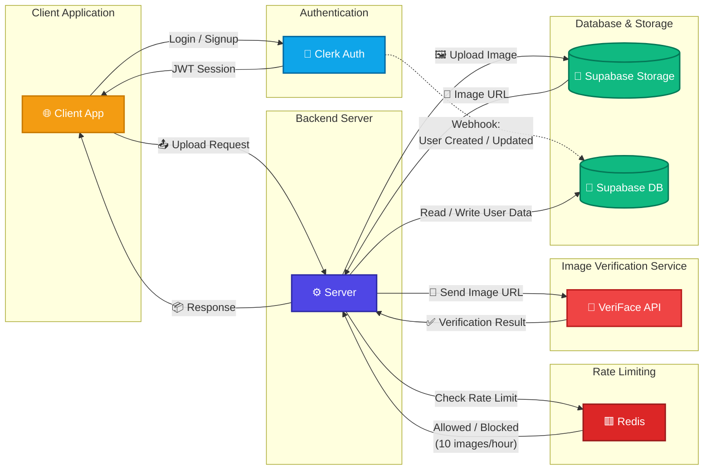

# 🔍 VeriFace
> **An AI-powered platform for detecting AI-generated images**
 
VeriFace analyzes uploaded images to determine whether they are **AI-generated or real**. It combines a trained machine learning model with a modern web stack — Next.js on the frontend and an Express/TypeScript backend — to deliver fast, accurate authenticity detection.
 
---
 
## 🚀 Features
- 🤖 **AI/Real Classification** — Detects whether an uploaded image is AI-generated or authentic
- ⚡ **Fast Detection** — Lightweight model inference with quick turnaround
- 🖼️ **Image Upload Support** — Simple drag-and-drop or file-select interface
- 🔗 **Decoupled Architecture** — Separate frontend, backend server, and ML API for clean separation of concerns
- 📊 **Trained ML Model** — Custom-trained model using Python and Jupyter Notebooks
- 🛡️ **Rate Limiting** — Capped at **10 image scans per hour per user** to ensure fair usage and protect backend resources
---
 
## 🛠️ Tech Stack
 
### 🎨 Frontend
| Technology | Purpose |
|---|---|
| **Next.js** | React-based frontend framework |
| **TypeScript** | Strongly typed JavaScript |
| **CSS** | Styling and layout |
 
### ⚙️ Backend / Server
| Technology | Purpose |
|---|---|
| **Express.js** | Node.js web framework for the API server |
| **TypeScript** | Strongly typed server-side logic |
| **Node.js** | JavaScript runtime |
 
### 🧠 ML / AI Layer
| Technology | Purpose |
|---|---|
| **Python** | ML model training and inference |
| **Jupyter Notebook** | Model experimentation and training workflow |
 
---
 
## 📁 Project Structure
```
VeriFace/
├── frontend/         # Next.js + TypeScript frontend application
├── server/           # Express + TypeScript backend server
├── api/              # Python-based ML model inference API
├── Data Flow Diagram.png
├── .gitignore
└── README.md
```
 
---
 
## 🔄 Data Flow

```
User uploads image
       ↓
  Next.js Frontend
       ↓
  Express Server (TypeScript)
       ↓
  Python ML API (Model Inference)
       ↓
  Result: AI-Generated ❌ / Real ✅
       ↓
  Response back to Frontend
```
 
---
 
## ⚠️ Known Limitations
 
- **Rate Limiting:** Each user is limited to **10 image scans per hour**. Once this limit is reached, subsequent scan requests will be rejected until the cooldown period passes.
- **Occasional Timeouts on Certain Images:** A small subset of uploaded images may fail with an internal server error after a **1-minute processing timeout**. This typically happens because the model pipeline is optimized for **JPG and PNG** formats — other formats or unusually encoded files can cause inference to hang or take significantly longer than expected. For best results, upload images in **JPG or PNG**.
---
 
## 📦 Getting Started
 
### Prerequisites
- Node.js (v18+)
- Python 3.x
- npm or yarn
---
 
### 🖥️ Frontend Setup
```bash
cd frontend
npm install
npm run dev
```
 
---
 
### ⚙️ Server Setup
```bash
cd server
npm install
npm run dev
```
 
---
 
### 🧠 ML API Setup
```bash
cd api
pip install -r requirements.txt
python main.py
```
 
---

## 🧠 VeriFace v2 — Model Evaluation Report

VeriFace v2 was evaluated against a dataset containing **modern AI-generated images** to measure how well the current model distinguishes AI-generated images from authentic images.

### 📊 Overall Performance

| Metric           |  Score |
| ---------------- | -----: |
| **Total Images** |    973 |
| **Accuracy**     | 56.83% |
| **Precision**    | 70.45% |
| **Recall**       | 38.03% |
| **F1 Score**     | 49.40% |

### 📋 Classification Report

```text
              precision    recall  f1-score   support

ai              0.7045    0.3803    0.4940       539
real            0.5103    0.8018    0.6237       434

accuracy                            0.5683       973
macro avg       0.6074    0.5911    0.5588       973
weighted avg    0.6178    0.5683    0.5518       973
```

### 🔢 Confusion Matrix

```text
[[205 334]
 [ 86 348]]
```

The confusion matrix can be interpreted as:

| Actual / Predicted |  AI | Real |
| ------------------ | --: | ---: |
| **AI**             | 205 |  334 |
| **Real**           |  86 |  348 |

The model correctly identified **205 AI-generated images** and **348 real images**. However, **334 AI-generated images were classified as real**, indicating that the current model has difficulty identifying newer and more sophisticated AI-generated imagery.

### ⚠️ Model Limitations

The results indicate that VeriFace v2 performs better at identifying **real images** than modern AI-generated images. While the model achieves a relatively high precision of **70.45% for the AI class**, its **38.03% recall** shows that a significant number of AI-generated images are still being classified as real.

This suggests that newer image-generation techniques can produce visual patterns that are increasingly difficult for the current model to distinguish from authentic images.

### 🔬 Current Model Architecture & Future Improvements

The current VeriFace model is based on a simple **CNN transfer-learning approach**. While this provides a lightweight and efficient solution, its ability to capture the subtle and increasingly complex artifacts present in modern AI-generated images is limited.

A **Vision Transformer (ViT)**-based architecture is an important direction for future versions of VeriFace. Vision Transformers can model global relationships across an image and may be better suited to detecting subtle generation artifacts that conventional CNN-based approaches can miss.

Future improvements could include:

* Transitioning from the current CNN transfer-learning model to a **Vision Transformer (ViT)** architecture.
* Training on a larger and more diverse dataset containing images from multiple generations of AI image generators.
* Including modern AI-generated images in the training dataset.
* Evaluating the model separately across different generations and families of image-generation models.
* Exploring ensemble approaches combining CNN and Transformer-based detectors.

> **Note:** The current model may perform better on AI-generated images produced by **older-generation models, particularly models from around 2021–2023**, compared with newer image-generation systems. This is an area that requires further evaluation using appropriately dated and independently sourced datasets.

---
 
## 🤝 Contributing
Contributions are welcome! Feel free to open issues or submit pull requests.
1. Fork the repository
2. Create your feature branch (`git checkout -b feature/your-feature`)
3. Commit your changes (`git commit -m 'Add your feature'`)
4. Push to the branch (`git push origin feature/your-feature`)
5. Open a Pull Request
---
 
## 📄 License
This project is open source. See the repository for details.
 
---
 
<div align="center">
  Conducting smooth operations since childhood 🏎️ — built by <a href="https://github.com/SaxenaLakshya">Lakshya Saxena</a>
</div>
